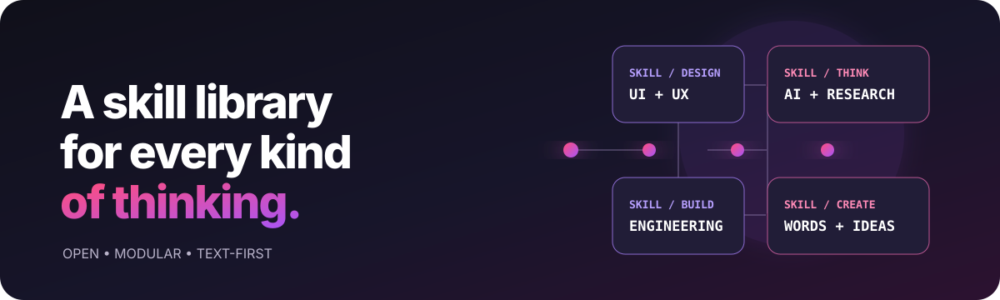
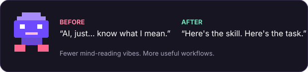
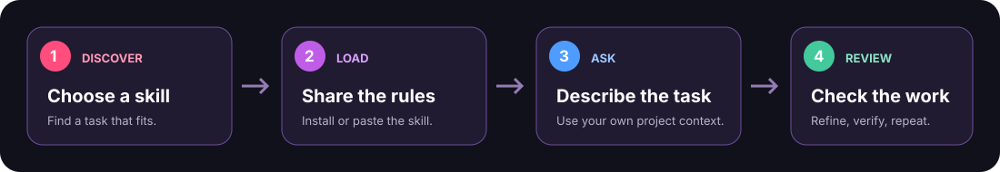

<div align="center">
  

  <h1>KZ-SKILLS</h1>
  <p><strong>One open library. Many skills. More capable AI workflows.</strong></p>
  <p>A growing, organized collection of reusable instructions for design, engineering, AI, research, writing, and the work we haven't imagined yet.</p>

  <p>
    <a href="#-quick-start">Quick start</a> ·
    <a href="#-explore-the-library">Explore skills</a> ·
    <a href="docs/CREATING-SKILLS.md">Create a skill</a> ·
    <a href="CONTRIBUTING.md">Contribute</a>
  </p>

  
</div>

---

> **Early-stage repository:** this first version establishes the structure, authoring rules, and validation workflow. Skill categories are ready to grow; no individual skills are published yet.

## ✨ What is KZ-SKILLS?

KZ-SKILLS is a curated, expandable library of **AI agent skills**: focused instruction packages that help an assistant handle a particular kind of task more consistently. A skill can include a `SKILL.md` plus optional references, scripts, and assets.

The repository is designed around the open [Agent Skills specification](https://agentskills.io/specification), while keeping each skill readable and useful even when someone loads it manually. Skills are instructions—not models, plugins, or a promise that every AI product supports the same features.

## 🧭 Quick start

### Use a skill with an Agent Skills-compatible assistant

1. Browse a category in [`skills/`](skills/).
2. Open the skill's folder and review its `SKILL.md` and any linked resources.
3. Use the assistant's documented skill-install or import flow. That flow differs by product and version.
4. Give the assistant a task that matches the skill's description, then review the result.

### Use a skill with another text-based AI

1. Open the skill's `SKILL.md` on GitHub and copy its contents.
2. Paste it into the conversation or the AI's custom-instructions area.
3. If the skill refers to files in `references/`, `assets/`, or `scripts/`, provide the relevant files too; pasted text alone cannot make an AI run code or access files it cannot see.
4. Ask for a task covered by the skill and check the output.

This manual route works as an instruction-sharing fallback, **not** as a guarantee of identical behavior. Tool access, file handling, context limits, and custom-instruction features depend on the AI product.



## 🗂️ Explore the library

| Category | Focus |
|---|---|
| [AI & agents](skills/ai-and-agents/) | Agent workflows, prompting patterns, model-aware tasks |
| [Design & UX](skills/design-and-ux/) | Product design, UI, UX, accessibility, design systems |
| [Software engineering](skills/software-engineering/) | Coding, architecture, testing, debugging, code review |
| [Data & research](skills/data-and-research/) | Data analysis, evidence gathering, research synthesis |
| [Writing & communication](skills/writing-and-communication/) | Writing, editing, documentation, clear communication |
| [Productivity & workflows](skills/productivity-and-workflows/) | Repeatable processes, planning, organization |
| [Security & reliability](skills/security-and-reliability/) | Defensive security, privacy, quality, resilience |
| [Learning & education](skills/learning-and-education/) | Teaching, tutoring, study plans, explanations |
| [Creative & media](skills/creative-and-media/) | Ideation, storytelling, visual and media workflows |
| [Business & product](skills/business-and-product/) | Product thinking, strategy, operations, customer discovery |

Categories are an organizing layer, not a limit: a skill may span multiple fields and should live where people are most likely to find it.

## 🧱 What a skill looks like

```text
skills/<category>/<skill-name>/
├── SKILL.md             # Required: when to use it and what to do
├── references/          # Optional: detailed material loaded when needed
├── scripts/             # Optional: small, documented helper programs
└── assets/              # Optional: templates, diagrams, and other resources
```

Keep the main instructions focused. Put large reference material in separate files and link to it with relative paths. See the [skill template](templates/skill-template/SKILL.md) and [authoring guide](docs/CREATING-SKILLS.md).

## ✅ Quality over quantity

Every published skill should explain when it applies, give concrete steps, handle important edge cases, and avoid pretending to have tools or access it does not have. The repository's validator checks basic structure and naming; human review is still required for usefulness, safety, and accuracy.

## 🧩 Compatibility, honestly

KZ-SKILLS uses a portable, text-first format. Some assistants support Agent Skills natively; others may need a manual copy/paste workflow or a platform-specific adapter. Check [compatibility notes](docs/COMPATIBILITY.md) before assuming a skill can be installed or run unchanged. A written skill cannot grant an AI new tools, permissions, or capabilities.

## 🤝 Contribute

Propose a new skill, improve an existing one, or help with docs and validation. Start with [`CONTRIBUTING.md`](CONTRIBUTING.md) and the [quality standards](docs/QUALITY-STANDARDS.md). New skills should be placed in the closest category and validated before a pull request.

## 🗺️ Project status

This repository is currently in its **foundation phase**: documentation, category structure, a reusable skill template, and basic automated checks. Individual skills, platform adapters, and richer discovery tools can be added incrementally without reshaping the library.

See the [repository architecture](docs/REPOSITORY-ARCHITECTURE.md) and [roadmap](docs/ROADMAP.md).

## 📚 References

- [Agent Skills specification](https://agentskills.io/specification)
- [Agent Skills reference implementation](https://github.com/agentskills/agentskills/tree/main/skills-ref)

## License

No license has been selected for this repository yet. Until a license is added, reuse rights are not granted by this README. See [`docs/ROADMAP.md`](docs/ROADMAP.md) for the open decision.
